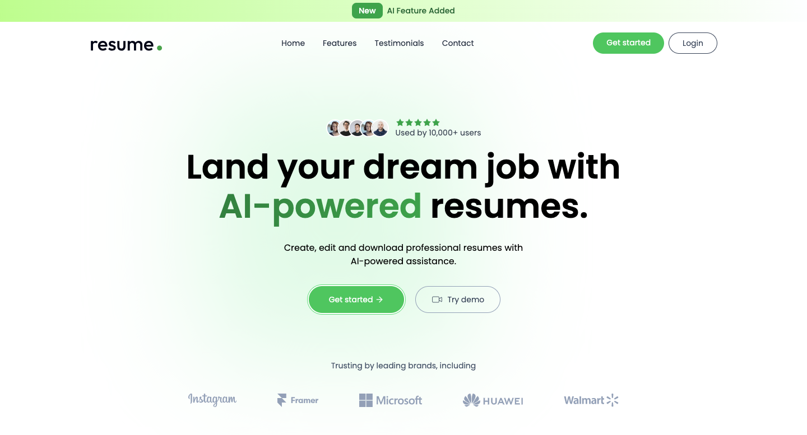

# 🤖 Resume Builder — Full Stack AI Resume Builder (MERN + Gemini + ImageKit)



Resume Builder is a full-stack AI-powered Resume Builder application built using the **MERN stack (MongoDB, Express, React, Node.js)**.  
It allows users to **create, preview, share, and optimize resumes using AI**, manage multiple templates, and upload images with background removal.  
The app integrates **Google Gemini AI** for resume optimization and **ImageKit** for storing profile images.

---

## 🧠 Features

- 🔐 **User Authentication (Sign up / Sign in)**
- 📝 **Create New Resume with multiple templates**
- 👀 **Live Preview & Shareable Link for resumes**
- 🤖 **AI Resume Optimization using Google Gemini**
- 🖼️ **Upload & Edit Images with background removal**
- ✏️ **Manage Resume (Add, Edit, Delete)**
- 💻 **Responsive Frontend built using React + Tailwind CSS**
- 📦 **MongoDB Database for storing resumes and user data**
- ⚡ **Express.js Backend with secure API routes**

---

## 💻 Tech Stack

| Technology                                                                                                     | Description                                              |
| -------------------------------------------------------------------------------------------------------------- | -------------------------------------------------------- |
|                 | Frontend library for building dynamic and interactive UI |
|  | Utility-first CSS framework for responsive UI design     |
|                                      | Ready-to-use UI components to speed up development       |
|                          | Frontend build tool for faster development               |
|                 | JavaScript runtime for backend                           |
|           | Web framework for building API routes                    |
|                 | NoSQL database for storing resumes and user data         |
|              | ODM library for MongoDB                                  |
|                       | HTTP client for frontend-backend communication           |
|                                            | Password hashing & encryption                            |
|                                                    | Middleware for cross-origin requests                     |
|                                                | Manage environment variables                             |
|                   | Token-based authentication                               |
|             | Cloud image optimization & background removal            |
|      | AI model for resume improvement and optimization         |

---

## 🚀 Features

| Feature                              | Description                                                                                      |
| ------------------------------------ | ------------------------------------------------------------------------------------------------ |
| 🔐 **User Authentication**           | Secure user signup, login, and JWT-based authentication with password hashing using **bcryptjs** |
| 📝 **Create New Resume**             | Build resumes using multiple templates with full customization                                   |
| 👀 **Live Preview & Shareable Link** | See resume changes in real-time and generate shareable links                                     |
| 🤖 **AI Resume Optimization**        | Improve and optimize resumes automatically using **Google Gemini AI**                            |
| 🖼️ **Upload & Edit Images**          | Add images to resumes and remove backgrounds using **ImageKit**                                  |
| ✏️ **Manage Resume**                 | Add, edit, and delete resumes easily                                                             |
| 💻 **Responsive Frontend**           | Clean and interactive UI built with **React.js** and **Tailwind CSS**                            |
| 📦 **MongoDB Database**              | Store resumes, templates, and user data securely                                                 |
| ⚡ **Express.js Backend**            | Secure REST API routes for all frontend interactions                                             |
| 🌐 **Environment Configuration**     | Manage API keys, MongoDB URI, and AI service keys securely using `.env`                          |
| ☁️ **Deployment Ready**              | Fully deployable MERN stack app with environment variables and production configurations         |

---

## 🗂️ Folder Structure

```
resume-builder/
│
├── client/ # Frontend (React.js)
│ ├── public/ # Static assets (favicon, logos, etc.)
│ ├── src/ # Source code
│ │ ├── components/ # Reusable UI components
│ │ ├── pages/ # Page components (Home, Dashboard, Resume, etc.)
│ │ ├── assets/ # Images and icons
│ │ ├── App.jsx # Main App component
│ │ └── main.jsx # Entry point
│ ├── package.json # Frontend dependencies
│ └── vite.config.js # Vite config
│
├── server/ # Backend (Node.js + Express)
│ ├── configs/ # Config files (DB, AI, ImageKit, multer)
│ ├── controllers/ # Controllers (Resume, User, AI)
│ ├── middlewares/ # Middleware (auth)
│ ├── models/ # MongoDB models (Resume, User)
│ ├── routes/ # API routes
│ ├── server.js # Main server file
│ ├── package.json # Backend dependencies
│ └── node_modules/ # Installed node packages
│
├── README.md # Project documentation
└── .gitignore # Git ignored files
```

## 🏁 Getting Started

Follow these steps to run the project locally:

1. **Clone the repository:**

```
git clone https://github.com/singhayush007/RESUME_BUILDER.git
```

2. **Navigate to the project folder:**

```
cd RESUME_BUILDER
```

3. **Install dependencies:**

```
npm install
```

4. **Create a .env.local file in the root and add your environment variables:**

```
# MongoDB URI
MONGODB_URI=your_mongodb_connection_uri

# Gemini AI Key
GEMINI_API_KEY=your_gemini_api_key

# ImageKit Keys
IMAGEKIT_PUBLIC_KEY=your_imagekit_public_key
IMAGEKIT_PRIVATE_KEY=your_imagekit_private_key
IMAGEKIT_URL_ENDPOINT=your_imagekit_url_endpoint
```

5. **Run the development server and client:**

```
cd client : npm run dev
cd server : npm run server
```

6. **Open the app in your browser:**

```
http://localhost:5173
```

## 💻 Deployment

You can deploy this app using Vercel, Docker, or any Node.js hosting platform.

## 📄 License

This project is licensed under the MIT License — feel free to use and modify it as per your needs.
