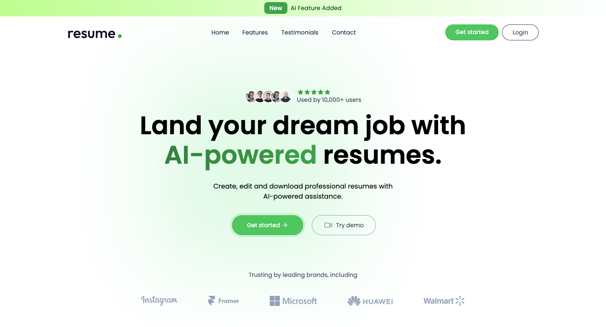

# 🤖 Resume Builder — Full Stack AI Resume Builder (MERN + Gemini + ImageKit)

<div align="center">


**A production-ready full-stack AI-powered Resume Builder using MERN stack, Google Gemini, and ImageKit.**

[🌐 Live Demo](https://airesumebuilderreact.vercel.app) · [🐛 Report Bug](https://github.com/singhayush007/RESUME_BUILDER/issues) · [✨ Request Feature](https://github.com/singhayush007/RESUME_BUILDER/issues)

</div>

---



---

## 📋 Table of Contents

- [About](#-about)
- [Features](#-features)
- [Tech Stack](#-tech-stack)
- [Folder Structure](#️-folder-structure)
- [Getting Started](#-getting-started)
- [Environment Variables](#-environment-variables)
- [Running the App](#-running-the-app)
- [Deployment](#️-deployment)
- [Contributing](#-contributing)
- [License](#-license)

---

## 📖 About

**Resume Builder** is a full-stack AI-powered application built using the **MERN stack (MongoDB, Express, React, Node.js)**.

It allows users to **create, preview, share, and optimize resumes using AI**, manage multiple templates, and upload profile images with background removal. The app integrates **Google Gemini AI** for smart resume optimization and **ImageKit** for cloud image storage and processing.

---

## ✨ Features

| Feature | Description |
| --- | --- |
| 🔐 **User Authentication** | Secure signup, login, and JWT-based authentication with password hashing using **bcryptjs** |
| 📝 **Create New Resume** | Build resumes using multiple templates with full customization |
| 👀 **Live Preview & Shareable Link** | See resume changes in real-time and generate shareable links |
| 🤖 **AI Resume Optimization** | Improve and optimize resumes automatically using **Google Gemini AI** |
| 🖼️ **Upload & Edit Images** | Add profile images to resumes and remove backgrounds using **ImageKit** |
| ✏️ **Manage Resumes** | Add, edit, and delete resumes easily |
| 💻 **Responsive Frontend** | Clean and interactive UI built with **React.js** and **Tailwind CSS** |
| 📦 **MongoDB Database** | Store resumes, templates, and user data securely |
| ⚡ **Express.js Backend** | Secure REST API routes for all frontend interactions |
| 🌐 **Environment Configuration** | Manage API keys, MongoDB URI, and AI service keys securely using `.env` |
| ☁️ **Deployment Ready** | Fully deployable MERN stack app with production-ready configurations |

---

## 💻 Tech Stack

### Frontend


### Backend


---

## 🗂️ Folder Structure

```
resume-builder/
│
├── client/                  # Frontend (React + Vite + Tailwind)
│   ├── public/              # Static assets (favicon, logos, etc.)
│   ├── src/
│   │   ├── components/      # Reusable UI components
│   │   ├── pages/           # Page components (Home, Dashboard, Resume, etc.)
│   │   ├── assets/          # Images and icons
│   │   ├── App.jsx          # Main App component
│   │   └── main.jsx         # Entry point
│   ├── .env                 # Local env (not committed)
│   ├── .env.example         # Env template
│   └── package.json
│
├── server/                  # Backend (Node.js + Express)
│   ├── configs/             # Config files (DB, AI, ImageKit, multer)
│   ├── controllers/         # Controllers (Resume, User, AI)
│   ├── middlewares/         # Middleware (auth)
│   ├── models/              # MongoDB models (Resume, User)
│   ├── routes/              # API routes
│   ├── server.js            # Main server file
│   ├── .env                 # Local env (not committed)
│   ├── .env.example         # Env template
│   └── package.json
│
├── README.md
└── .gitignore
```

---

## 🏁 Getting Started

### Prerequisites

Make sure you have the following installed:

- [Node.js](https://nodejs.org/) v18+
- [npm](https://www.npmjs.com/) v9+
- [MongoDB Atlas](https://www.mongodb.com/cloud/atlas) account (or local MongoDB)
- [ImageKit](https://imagekit.io/) account
- [Google Gemini API Key](https://aistudio.google.com/app/apikey)

### 1. Clone the repository

```bash
git clone https://github.com/singhayush007/RESUME_BUILDER.git
cd RESUME_BUILDER
```

### 2. Install dependencies

Each part of the app has its own `package.json`. Install dependencies separately:

```bash
# Backend
cd server && npm install

# Frontend
cd ../client && npm install
```

---

## 🔐 Environment Variables

Each package has a `.env.example` file. Copy it to `.env` and fill in your values.

### Backend (`server/.env`)

```bash
cp server/.env.example server/.env
```

| Variable | Description |
| --- | --- |
| `JWT_SECRET` | Secret key for signing JWT tokens |
| `MONGODB_URI` | MongoDB connection string |
| `IMAGEKIT_PRIVATE_KEY` | ImageKit private API key |
| `OPENAI_API_KEY` | Gemini API key (used via OpenAI-compatible endpoint) |
| `OPENAI_BASE_URL` | Gemini base URL (`https://generativelanguage.googleapis.com/v1beta/openai/`) |
| `OPENAI_MODEL` | Model name (e.g. `gemini-2.5-flash`) |

### Frontend (`client/.env`)

```bash
cp client/.env.example client/.env
```

| Variable | Description |
| --- | --- |
| `VITE_API_BASE_URL` | Backend API base URL (e.g. `http://localhost:5000`) |

---

## ▶️ Running the App

Open **two separate terminals** and run:

```bash
# Terminal 1 — Backend (runs on http://localhost:5000)
cd server
npm run server
```

```bash
# Terminal 2 — Frontend (runs on http://localhost:5173)
cd client
npm run dev
```

Then open [http://localhost:5173](http://localhost:5173) in your browser.

---

## ☁️ Deployment

This project is deployed on **Vercel**. You can also deploy on **Railway**, **Render**, or **Heroku**.

| Service | Recommended For |
| --- | --- |
| [Vercel](https://vercel.com) | Frontend |
| [Vercel](https://vercel.com) / [Railway](https://railway.app) | Backend |
| [MongoDB Atlas](https://www.mongodb.com/cloud/atlas) | Database |
| [ImageKit](https://imagekit.io) | Image storage & processing |

> Make sure to set all environment variables in your hosting platform's dashboard before deploying.

---

## 🤝 Contributing

Contributions are welcome! Here's how to get started:

1. Fork the repository
2. Create a new branch: `git checkout -b feature/your-feature-name`
3. Commit your changes: `git commit -m 'add: your feature description'`
4. Push to the branch: `git push origin feature/your-feature-name`
5. Open a Pull Request

---

## 📄 License

This project is licensed under the **MIT License** — feel free to use and modify it as per your needs.

---

<div align="center">
  Made with ❤️ by <a href="https://github.com/singhayush007">Ayush Singh</a>
</div>
